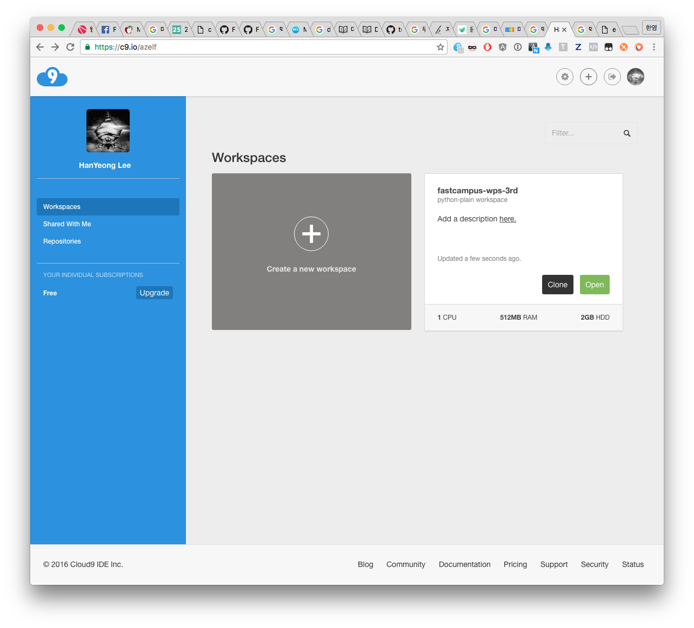
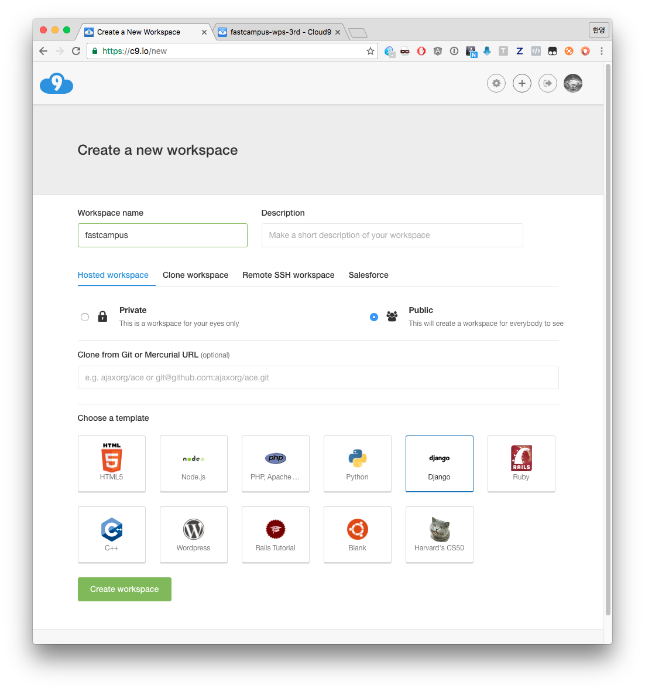
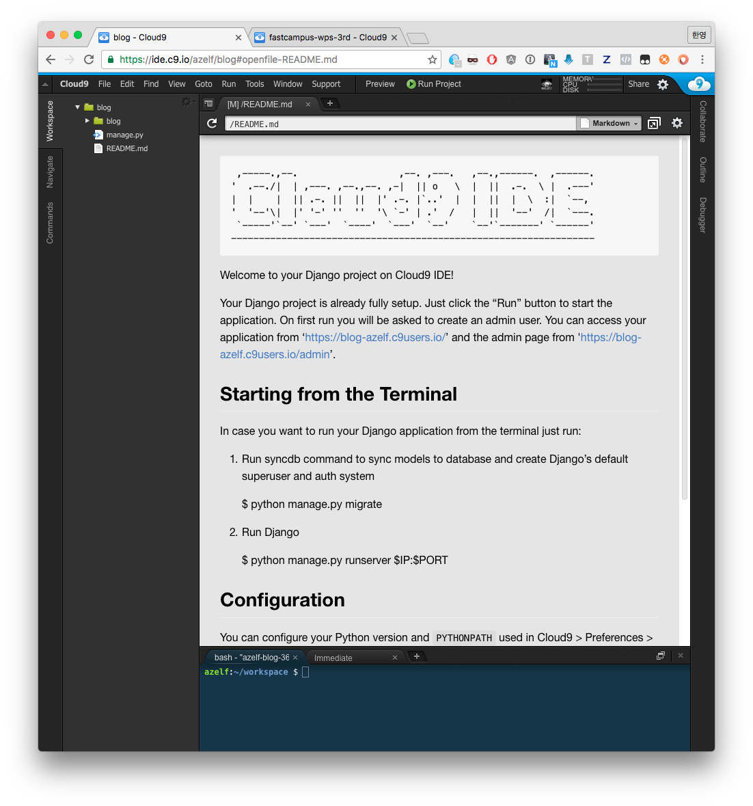
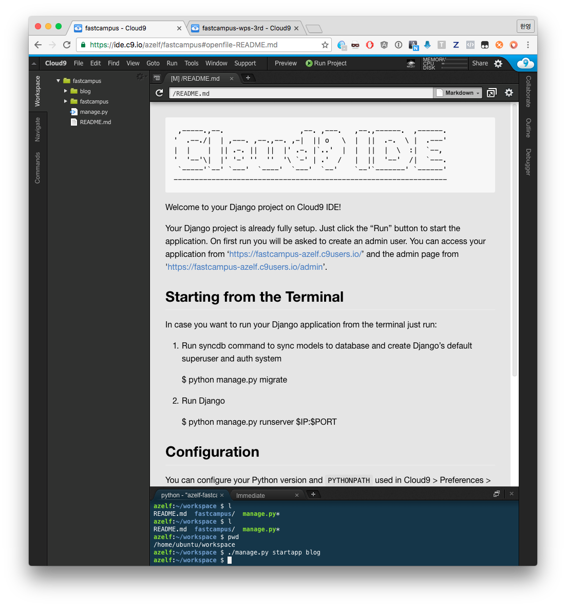
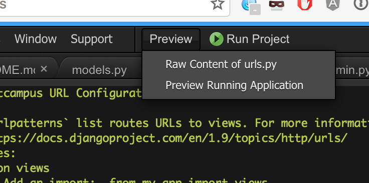
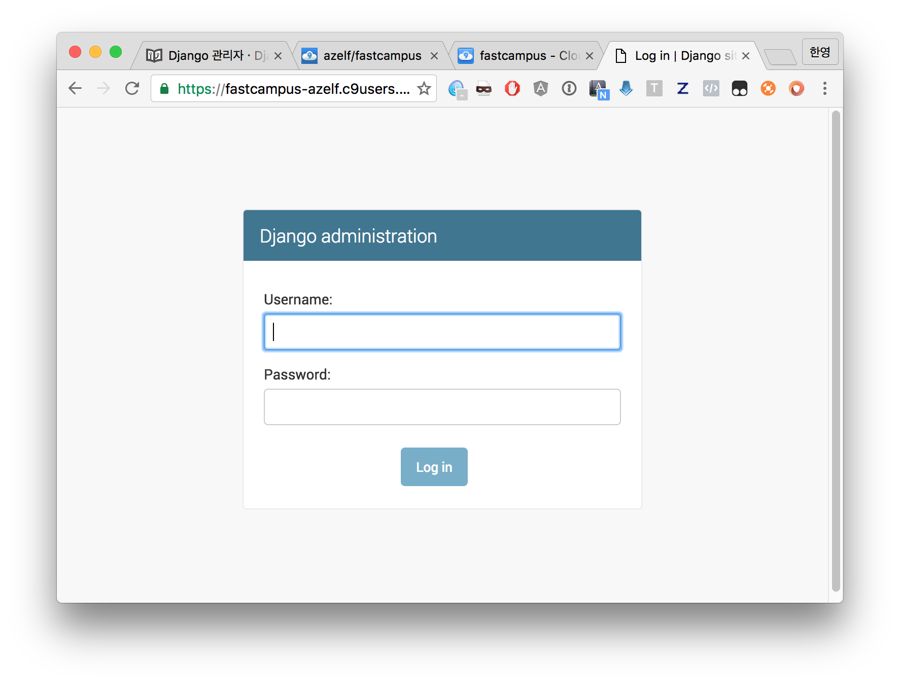
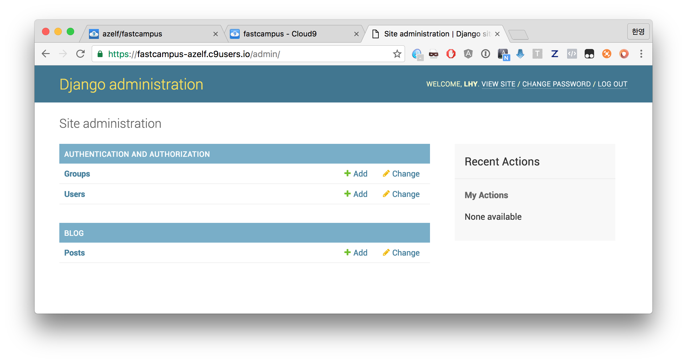

###### Web Programming School  **[16.08.19]**

## Pre-Course (Day1)

### Pre-Course 목표
블로그 만들기


-

### 전체 목차
1. Cloud9 환경설정
2. 인터넷과 서버
3. 웹 프레임워크
5. Django의 MTV구조
6. Django Model
7. Django 관리자
7. Django View
8. Django Template
9. Django urls
10. Django ORM
11. View에서의 동적 데이터 전달
12. Django template tags
13. CSS, Bootstrap
14. Template extending
15. Template links
16. Django Form

-

### Cloud9 환경설정
+ c9.io 접속
+ Create a new workspace 선택



-

+ 새 Workspace 생성



-

+ 세팅 완료



-

### 인터넷과 서버

인터넷으로 볼 수 있는 naver.com이나 google.co.kr과 같은 웹 사이트는 컴퓨터에 저장된 파일입니다

서버는 (일반적으로) 여러사람이 접속해도 무리없이 버텨낼 수 있는 컴퓨터를 뜻합니다

#### 웹 사이트는 아래와 같이 동작합니다

+ 웹 사이트가 동작할 기계 (물리적 서버)가 존재하며,
+ 해당 서버에서는 접속한 사용자들의 요청을 받습니다
+ 서버는 받은 요청에 대해서 적절한 응답을 돌려줍니다


-

### 웹 프레임워크

Django는 파이썬으로 만들어진 웹 애플리케이션 프레임워크(Web application framework)입니다

쉽고 빠르게 웹사이트를 개발할 수 있도록 도와주는 프레임워크이죠


#### 프레임워크는 왜 필요한가?

웹 사이트를 만들때에는 비슷한 유형의 요소들이 항상 필요합니다. 회원관리, 로그인 등의 사용자 기능이나 관리자 기능, 파일 업로드/다운로드 기능 등등...

같은 기능을 여러 개발자들이 똑같이 만드는 시간소모를 덜기 위해 웹 사이트 제작에 필요한 요소들을 미리 만들어서 모아놓은것이 프레임워크입니다


-


### Django의 MTV구조


Django는 개발자들의 편의와 유지보수의 용이성을 위해 Model-Template-View라는 패턴을 제공합니다

**Model**은 데이터베이스의 구조를 설정하는 컴포넌트이며,

**Template**은 사용자들에게 보이는 디자인 영역. 즉, HTML구조만을 모아놓은 컴포넌트입니다.

마지막으로 **View**는 **Model**의 데이터를 **Template**에 보여주는 역할을 합니다

-

### Django Model

블로그에 데이터를 저장할 모델을 생성해보겠습니다

그 전에, ```객체(Object)```에 관해 잠깐 설명하겠습니다

-

#### 객체

프로그래밍 개발 방법중 ```객체 지향 프로그래밍``` 이라 부르는 개념이 있습니다.

이 방법은 프로그램이 작동하는데에 특정 모델을 만들어 해당 모델이 어떤 역할과 성질을 가지는지 미리 정의하는 방식이라고 생각하시면 됩니다.

객체는 여기서 ```속성(properties)```과 ```행동(methods)```을 모아놓은 것입니다.


예를 들어, ```자동차(Cart)```라는 객체를 모델링 한다면, 아래와 같이 나타낼 수 있습니다

	자동차
	------------
	[속성(properties)]
	종류 (승용차, SUV, 스포츠카...)
	가격
	색상 (빨강, 노랑, 파랑, 검정...)
	
	[행동(methods)]
	시동걸기
	앞으로 가기
	멈추기
	클락션 울리기
	
	
객체지향이라는 개념은 현실에 존재하는 것을 속성과 행위로 분류해서 나타내는 것입니다

우리는 블로그를 만들 것이므로, 블로그에 등록되는 글(Post)를 객체로 나타내봅시다


	Post
	----------
	[properties]
	title
	content
	author
	created_date
	is_published
	
	[method]
	publish
	

is_published는 출판여부 (다른 사용자들이 읽을 수 있도록 출판된 상태인지)를 나타내며,

publish 메서드는 글을 출판상태로 만드는 행동입니다.

-

#### 애플리케이션 생성

fastcampus 프로젝트에 blog 애플리케이션을 추가해봅시다

	cd /home/ubuntu/workspace
	./manage.py startapp blog



왼쪽의 폴더목록에 ```blog```폴더가 생성됩니다	

-

#### settings.py에 해당 애플리케이션 사용 설정

```fastcampus/fastcampus/settings.py```의 ```INSTALLED_APPS```에 ```'blog'```를 추가해줍니다

    INSTALLED_APPS = (
        'django.contrib.admin',
        'django.contrib.auth',
        'django.contrib.contenttypes',
        'django.contrib.sessions',
        'django.contrib.messages',
        'django.contrib.staticfiles',
        'blog',
    )
    
-

#### 모델 작성

```blog/models.py```에 아래 내용을 추가합니다

	from __future__ import unicode_literals
	from django.db import models
	
	class Post(models.Model):
	    author = models.ForeignKey('auth.User')
	    title = models.CharField(max_length=200)
	    text = models.TextField()
	    created_date = models.DateTimeField(auto_now_add=True)
	    is_published = models.BooleanField(default=False)
	
	    def publish(self):
	        self.is_published = True
	        self.save()
	
	    def __unicode__(self):
	        return self.title
	        

-

#### 코드설명

+ ```class Post(models.Model)```은 모델을 정의하는 코드입니다

+ ```class```는 객체를 정의한다는 키워드입니다

+ ```Post```는 모델의 이름입니다. 클래스의 첫 글자는 대문자를 사용합니다

##### 속성을 정의할 때는, 각 속성이 어떤 성질을 가지고 있는지 구분합니다.

+ ```models.CharField```는 제한된 글자수의 텍스트를 정의할 때 사용합니다.

+ ```models.TextField```는 제한없는 글자수의 긴 텍스트를 정의합니다.

+ ```models.DateTimeField```는 날짜/시간을 위한 속성입니다.

+ ```models.ForeignKey```는 다른 모델에 대한 링크를 위한 속성입니다.

+ ```models.BooleanField```는 참/거짓 (True/False)를 정의하는 속성입니다.

##### 메서드

```def publish(self)```는 ```publish```라는 행동(메서드:method)입니다.

-

#### 데이터베이스 생성

명령어 입력

	./manage.py makemigrations
	./manage.py migrate
	
아래와 같은 메세지가 출력됩니다

	azelf:~/workspace $ ./manage.py makemigrations
	Migrations for 'blog':
	  0001_initial.py:
	    - Create model Post
	azelf:~/workspace $ ./manage.py migrate
	Operations to perform:
	  Apply all migrations: admin, blog, contenttypes, auth, sessions
	Running migrations:
	  Rendering model states... DONE
	  Applying contenttypes.0001_initial... OK
	  Applying auth.0001_initial... OK
	  Applying admin.0001_initial... OK
	  Applying admin.0002_logentry_remove_auto_add... OK
	  Applying contenttypes.0002_remove_content_type_name... OK
	  Applying auth.0002_alter_permission_name_max_length... OK
	  Applying auth.0003_alter_user_email_max_length... OK
	  Applying auth.0004_alter_user_username_opts... OK
	  Applying auth.0005_alter_user_last_login_null... OK
	  Applying auth.0006_require_contenttypes_0002... OK
	  Applying auth.0007_alter_validators_add_error_messages... OK
	  Applying blog.0001_initial... OK
	  Applying sessions.0001_initial... OK	

-

### Django 관리자

Django admin site는 장고의 최대 장점 중 한 가지 입니다.

모델에 의해 자동으로 생성되는 관리자 페이지는 실제 프로젝트시에 할 일을 대폭 줄여줍니다.

먼저 앞에서 생성한 Post모델을 관리자 페이지에서 사용하겠다고 등록해줍니다

blog/admin.py


	from django.contrib import admin
	from blog.models import Post
	
	admin.site.register(Post)


이제 테스트 서버로 관리자페이지에 로그인해보겠습니다

	./manage.py runserver 0:8080


테스트 서버가 실행되었습니다. 

확인하기 위해 Preview -> Preview Running Application을 눌러줍니다





주소 맨 뒤에 /admin을 추가하고 엔터를 누르시면 아래와 같은 로그인 화면이 나타납니다

	



-

#### 관리자계정 생성

관리자 페이지에 로그인 하기위해서는 모든 권한을 가진 슈퍼유저(superuser)가 필요합니다.

manage.py의 createsuperuser는 슈퍼유저를 만들어주는 커맨드입니다

	./manage.py createsuperuser
	^Cazelf:~/workspace $ ./manage.py createsuperuser
	Username (leave blank to use 'ubuntu'): azelf
	Email address: 
	Password: 
	Password (again): 
	Superuser created successfully.

-


만들어진 계정으로 로그인 해줍니다




-

### Django View

View는 애플리케이션의 "로직"을 담당합니다.

이제 앞에서 작성한 **Model**의 내용을 **Template**으로 전달할 **View**를 작성합니다.


```blog/views.py```파일에 아래와 같이 작성합니다


	from django.shortcuts import render
	from blog.models import Post
	
	def post_list(request):
	    posts = Post.objects.all()
	    return render(request, 'blog/post_list.html', {'posts': posts})


### Django urls

url은 웹 주소입니다

Django의 urls.py는 URLconf(URL configuration)으로, URL과 일치하는 View를 찾기 위한 패턴들의 집합입니다.

```fastcampus/urls.py```파일에 아래와 같이 작성합니다


	#-*- coding: utf-8 -*-
	from django.conf.urls import url
	from django.contrib import admin
	from django.conf import settings
	from django.conf.urls.static import static
	from blog.views import post_list
	
	urlpatterns = [
	    url(r'^admin/', admin.site.urls),
	    url(r'^blog/post-list/$', post_list),
	]


우리의 사이트에 /blog/post-list/로 접속하는 사람들에게
**blog.views**의 post_file 함수의 내용을 보여줄 것입니다

-

### Django ORM

ORM은 Object-relational mapping의 약자로, 데이터베이스를 좀 더 쉽게 다룰 수 있도록 해주는 기술입니다

```python manage.py shell```을 이용해서 Django shell을 실행합니다

	from blog.models import Post
	Post.objects.all()
	[<Post: (1) 패스트캠퍼스 프리코스 강의>, <Post: (2) 안드로이드 개발 SCHOOl>, <Post: (3) 웹 프로그래밍 SCHOOL>, <Post: (4) iOS 개발 SCHOOL
	
Post.objects.all()은 모든 Post를 불러옵니다

-