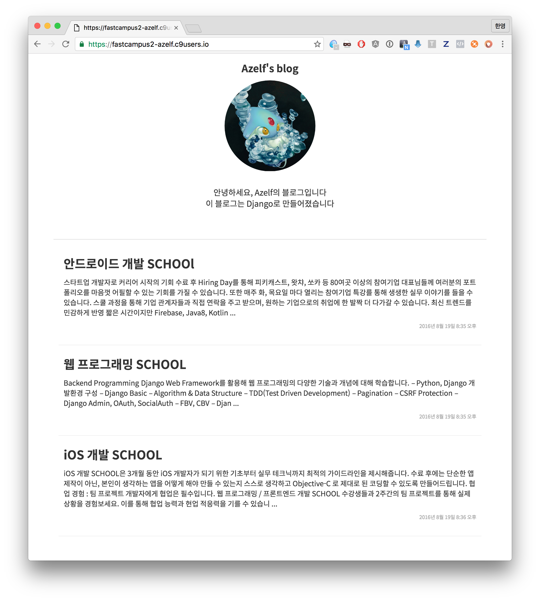

###### Web Programming School  **[16.08.26]**

## Pre-Course (Day2)

### Pre-Course 목표
블로그 만들기

2일차 - 블로그 꾸미기 및 로그인

-

### 전체 목차
1. CSS 스타일
2. 글 목록화면 개선
3. 글 상세화면 View작성, URL연결
4. 로그인 템플릿 구성
5. 로그인 URL링크

-

### CSS파일 작성

기존 HTML파일의 모양을 예쁘게 만들기 위해 CSS파일을 작성합니다

Static폴더 아래에 작성 ```/static/sss/style.css```



-

문서 전체에 padding지정

	body {
	    padding-top: 15px;
	    padding-left: 50px;
	    padding-right: 50px;
	    padding-bottom: 15px;
	}

-

Top부분의 스타일
	
	.blog-top-container {
	    text-align: center;
	    padding-bottom: 50px;
	    border-bottom: 1px solid #DDD;
	}
	.blog-top-container .blog-title {
	    font-size: 20px;
	    font-weight: bold;
	}
	.blog-top-container .img-profile {
	    width: 180px;
	}
	.blog-top-container .introduce {
	    margin-top: 30px;
	    font-size: 16px;
	}

-


글 목록 스타일

	.post-list-container {
	    padding: 10px;    
	}
	
	.post-list-container .post {
	    padding-top: 20px;
	    padding-bottom: 20px;
	    padding-left: 10px;
	    padding-right: 10px;
	    border-bottom: 1px solid #EEE;
	}
	.post-list-container .post .post-title {
	    font-size: 24px;
	    font-weight: bold;
	}
	.post-list-container .post .post-content {
	    margin-top: 10px;
	    font-size: 14px;
	}
	.post-list-container .post .post-created {
	    text-align: right;
	    font-size: 10px;
	    color: #aaa;
	}

-

글 상세화면 스타일

	.post-detail-container {
	    
	}
	.post-detail-container .img-post-cover {
	    max-width: 100%;
	}
	.post-detail-container .post-title {
	    font-size: 40px;
	    font-weight: bold;
	}
	.post-detail-container .post-created {
	    font-size: 12px;
	    color: #999;
	}
	.post-detail-container .post-content {
	    margin-top: 40px;
	    font-size: 14px;
	    color: #666;
	    line-height: 2.3em;
	}
	.post-detail-container .btn-list {
	    margin-top: 20px;
	}

-


### 글 목록화면에 이미지 출력

-

'url'태그는 urls.py에 정의된 뷰의 주소를 템플릿에서 사용하게 해줍니다



-


'static'태그는 STATIC_DIRS에 지정된 파일을 링크할 때 사용합니다



-

템플릿 변수에 적용하는 필터는 파이프라인( | )으로 사용합니다

truncatechars는 해당 글자수 이후에는 ...으로 줄임을 나타냅니다

linebreaksbr은 줄 나눔을 `<br>`태그를 사용하여 나타냅니다


`templates/blog/post_list.html`을 수정

	
	<!DOCTYPE html>
	<html>
	    <head>
	        <!-- 합쳐지고 최소화된 최신 CSS -->
	        <link rel="stylesheet" href="https://maxcdn.bootstrapcdn.com/bootstrap/3.3.2/css/bootstrap.min.css">
	        <!-- 부가적인 테마 -->
	        <link rel="stylesheet" href="https://maxcdn.bootstrapcdn.com/bootstrap/3.3.2/css/bootstrap-theme.min.css">
	        <!-- 스타일 CSS -->
	        <link rel="stylesheet" href="">
	    </head>
	    <body>
	        
	        <span>{{ user.username }}(으)로 로그인중입니다</span>
	        
	        <a href="">로그인하기</a>
	        
	        
	        
	        <div class="blog-top-container">
	            <p class="blog-title">Azelf's blog</p>
	            
	            <p class="introduce">
	                안녕하세요, Azelf의 블로그입니다<br>
	                와 되게어렵다
	            </p>
	        </div>
	        
	        <div class="post-list-container">
	            
	            <div class="post">
	                <a href="">
	                    <p class="post-title">{{ post.title }}</p>
	                </a>
	                <p class="post-content">{{ post.text|truncatechars:200|linebreaksbr }}</p>
	                <p class="post-created">{{ post.created }}</p>
	            </div>
	            
	        </div>
	        
	    </body>
	</html>
	


### 글 상세화면 작성

```blog/views.py```파일

	# pk값의 Post를 돌려주는 함수
	def post_detail(request, pk):
	    post = Post.objects.get(id=pk)
	    
	    return render(request, 'blog/post_detail.html', {'post': post})
	    
-

	    
```fastcampus/urls.py```파일

urlpatterns에 아래 내용을 추가

	url(r'^post/(?P<pk>[0-9]+)$', post_detail, name='post-detail'),


-

### 로그인 템플릿

```templates/login.html```파일

	<!DOCTYPE html>
	<html>
	    <body>
	        <form method="post">
	            {{ form }}
	            <button type="submit">로그인</button>
	        </form>
	    </body>
	</html>


### 로그인 URL연결

장고에서 기본적으로 제공하는 로그인 뷰를 사용합니다

```fastcampus/urls.py```파일

	from django.contrib.auth.views import login as auth_login
	
	...중략
	
	urlpatterns = [
		...중략
		url(r'^login/$', 
	        auth_login, 
	        name='login',
	        kwargs={'template_name': 'login.html'}
	    ),
	]
